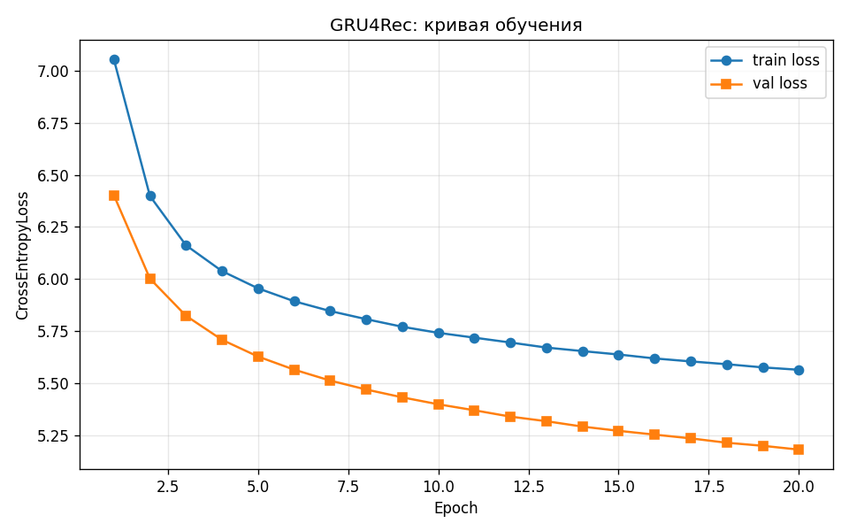
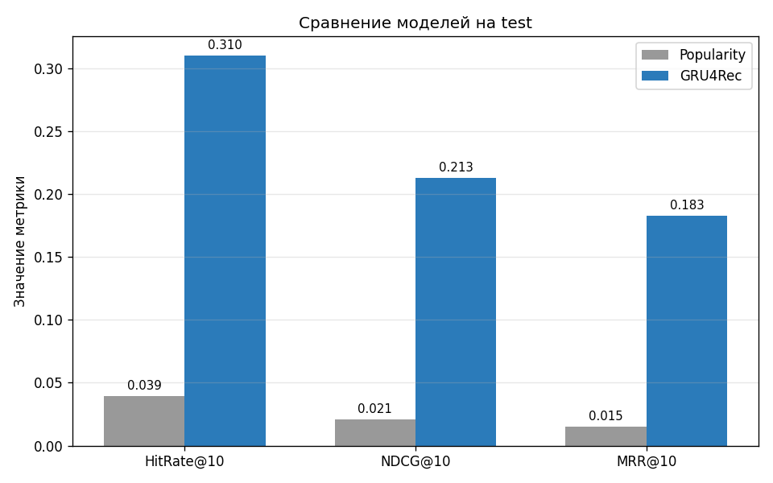
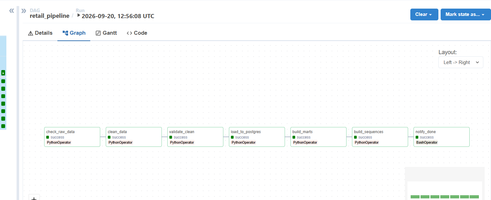
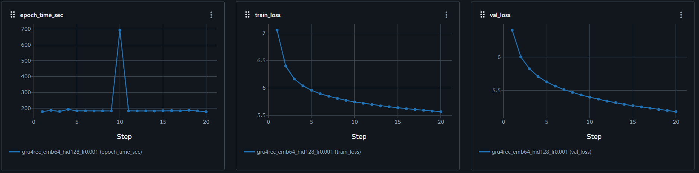
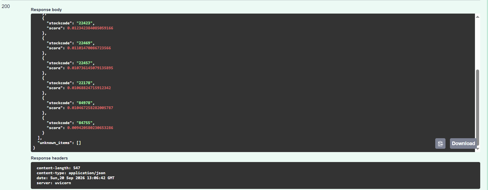

# Online Retail RecSys — End-to-End DE + DL Pipeline

[](https://github.com/AlexNeNaprasno/online-retail-recsys/actions/workflows/ci.yml)
[](https://www.python.org/downloads/)
[](https://docs.docker.com/compose/)
[](LICENSE)

End-to-end Data Engineering + Deep Learning pipeline for **next-item recommendation** on the [Online Retail dataset](https://www.kaggle.com/datasets/carrie1/ecommerce-data).

**Result:** GRU4Rec model reaches **HitRate@10 = 31.0%** on test vs **3.9%** for a popularity baseline — an **8× improvement**.

---

## TL;DR

| Component | What it does |
|---|---|
| **Data pipeline** | Kaggle CSV → cleaning → PostgreSQL → marts (`dim_customer`, `dim_product`, `fact_sales`) |
| **DL model** | GRU4Rec (PyTorch) trained on user purchase sequences |
| **Orchestration** | Airflow DAG runs the whole DE pipeline end-to-end |
| **Experiment tracking** | MLflow logs params, metrics, artifacts |
| **Serving** | FastAPI `/recommend` endpoint returns top-K next-item predictions |
| **Infra** | One `docker compose up -d` — 5 services: API, MLflow, Postgres, Airflow webserver, Airflow scheduler |

---

## Architecture

```text
                Kaggle CSV
                    │
                    ▼
        ┌───────────────────────┐
        │   Airflow DAG         │  retail_pipeline
        │  (clean → validate →  │
        │   Postgres → marts)   │
        └───────────┬───────────┘
                    │
       ┌────────────┼────────────┐
       ▼            ▼            ▼
  raw_retail   dim_customer   dim_product
  fact_sales
                    │
                    ▼
        ┌───────────────────────┐
        │  Sequence building    │  per-user, top-3000 SKU vocab
        │  train / val / test   │  (time-aware split)
        └───────────┬───────────┘
                    │
                    ▼
        ┌───────────────────────┐
        │  GRU4Rec (PyTorch)    │  Embedding → GRU → Linear
        │  + Popularity baseline│  HitRate / NDCG / MRR
        └───────────┬───────────┘
                    │
          ┌─────────┴──────────┐
          ▼                    ▼
    MLflow tracking      FastAPI /recommend
    (params, metrics,    (Docker, port 8000)
     artifacts, plots)
```

---

## Stack

**Data Engineering:** Python, SQL, PostgreSQL 15, Airflow 2.8, Docker, Docker Compose
**Deep Learning:** PyTorch, GRU4Rec
**MLOps:** MLflow, FastAPI, Uvicorn, Pydantic
**Tooling:** Git, GitHub Actions, Ruff, Pytest, Matplotlib

---

## Results

### Model comparison on test set

| Metric | Popularity baseline | GRU4Rec | Δ |
|---|---:|---:|---:|
| **HitRate@10** | 0.0392 | **0.3102** | **+692%** |
| **NDCG@10** | 0.0206 | **0.2130** | **+935%** |
| **MRR@10** | 0.0149 | **0.1827** | **+1128%** |

Random baseline (10 of 3000 SKU) ≈ 0.33%. GRU4Rec is **~94× better than random**.

### Training curve



### Model comparison



### Airflow DAG run



### MLflow experiment tracking



### FastAPI `/recommend` (Swagger UI)



---

## Data

**Online Retail Dataset** — transactions from a UK-based online gift retailer, 01.12.2010 – 09.12.2011.

- **Source:** [Kaggle / carrie1/ecommerce-data](https://www.kaggle.com/datasets/carrie1/ecommerce-data)
- **Raw size:** 541,909 rows × 8 columns (~45 MB)
- **After cleaning:** ~391K rows, 4,334 customers, 3,660 products

Cleaning steps: remove cancellations (`InvoiceNo` starting with `C`), refunds (`Quantity ≤ 0`), invalid prices (`UnitPrice ≤ 0`), guest purchases (`CustomerID = NaN`), and non-product SKUs (`POST`, `DOT`, `BANK CHARGES`, etc.).

Data is **not committed** to the repo (size + license). To download:

```bash
python src/data/download_data.py
```

Requires a Kaggle API token at `~/.kaggle/kaggle.json`.

---

## Repo structure

```text
.
├── airflow/                  # Airflow DAGs + custom image
│   ├── Dockerfile
│   ├── requirements-airflow.txt
│   └── dags/
│       └── retail_pipeline.py
├── data/                     # not committed
│   ├── raw/                  # data.csv (Kaggle)
│   └── processed/            # retail_clean.parquet, vocab.json, splits/
├── docker/                   # Dockerfile for API
│   └── Dockerfile.api
├── reports/
│   └── figures/              # plots for README
├── results/                  # metrics JSON
├── src/
│   ├── data/                 # download, clean
│   ├── features/             # vocab, sequences, splits
│   ├── models/               # GRU4Rec, training, evaluation, baseline
│   ├── evaluation/           # plotting
│   ├── serving/              # FastAPI app + Pydantic schemas
│   └── utils/
├── tests/                    # pytest
├── checkpoints/              # model weights (not committed)
├── docker-compose.yml
├── requirements.txt
└── README.md
```

---

## Quick start

### 1. Prerequisites

- Docker Desktop (with Docker Compose v2)
- Python 3.11+ (only if you want to retrain the model)
- Kaggle API token for downloading data

### 2. Download the data

```bash
python -m venv .venv
source .venv/bin/activate       # Windows: .venv\Scripts\activate
pip install -r requirements.txt
python src/data/download_data.py
```

### 3. Train the model (optional)

```bash
python -m src.models.train_gru4rec_mlflow
```

This writes `checkpoints/gru4rec_best.pt` and logs everything to MLflow.

### 4. Run the full stack

```bash
docker compose up -d --build
```

| Service | URL |
|---|---|
| FastAPI + Swagger | http://localhost:8000/docs |
| MLflow UI | http://localhost:5000 |
| Airflow UI | http://localhost:8088 (admin / admin) |
| PostgreSQL | localhost:5432 (retail / retail) |

### 5. Trigger the DE pipeline

Open Airflow UI → `retail_pipeline` → unpause → **Trigger DAG**.

All 7 tasks should turn green in 2–5 minutes:
`check_raw_data → clean_data → validate_clean → load_to_postgres → build_marts → build_sequences → notify_done`

---

## API usage

### `POST /recommend`

```bash
curl -X POST http://localhost:8000/recommend \
  -H "Content-Type: application/json" \
  -d '{
    "history": ["85123A", "22423", "85099B", "47566", "84879"],
    "top_k": 5
  }'
```

Response:

```json
{
  "recommendations": [
    {"stockcode": "22384", "score": 0.139},
    {"stockcode": "23209", "score": 0.091},
    {"stockcode": "22382", "score": 0.074}
  ],
  "unknown_items": []
}
```

### `GET /health`

```bash
curl http://localhost:8000/health
```

```json
{"status": "ok", "model_loaded": true, "vocab_size": 3001, "window": 20}
```

---

## Tests

```bash
pytest tests -v
```

CI runs the same on every push (`.github/workflows/ci.yml`).

---

## Roadmap

- [ ] BERT4Rec / Transformer encoder instead of GRU
- [ ] Hyperparameter search via Optuna + MLflow
- [ ] Incremental retraining DAG in Airflow
- [ ] BI dashboard (Metabase / Yandex DataLens)
- [ ] Model registry + canary deployment

---

## License

MIT. Dataset license: [CC0: Public Domain](https://www.kaggle.com/datasets/carrie1/ecommerce-data).

## Author

**AlexNeNaprasno** — [github.com/AlexNeNaprasno](https://github.com/AlexNeNaprasno)